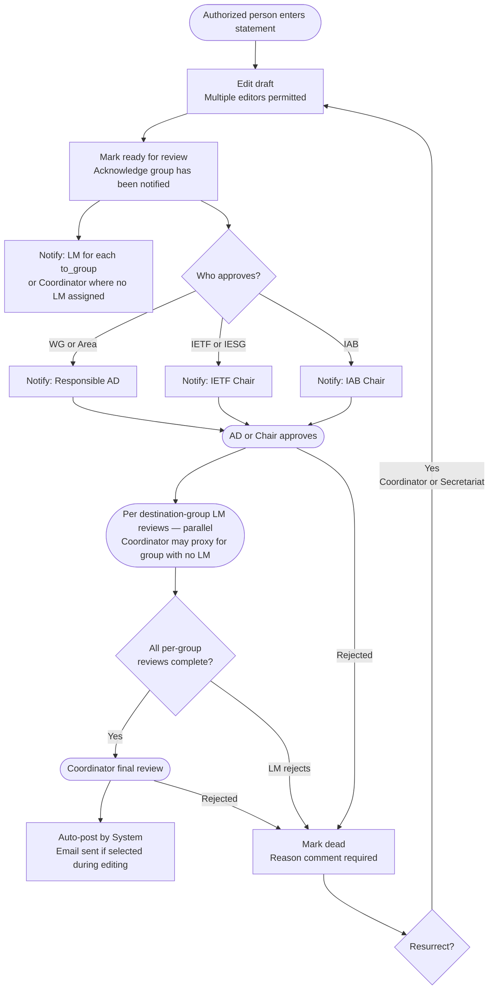
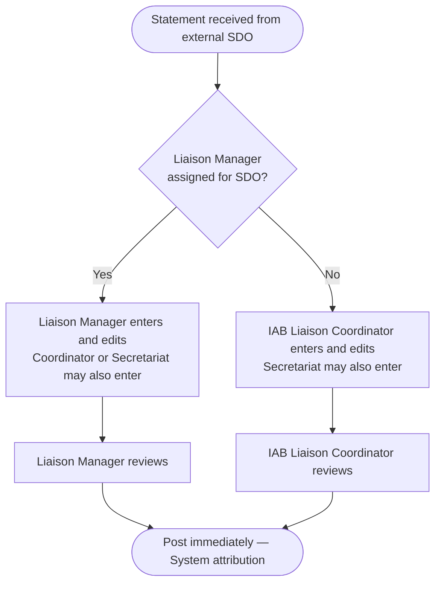

# IETF Datatracker Liaison Statement Tool

>[!WARNING]
>This is currently an experimental repository to discuss whether restructuring the issues from the repositories mentioned below in this way is useful. Should we pursue this path, this repo will be deleted and rebuilt based on feedback on improving its usefulness. This reorganization was constructed with the help of Claude.
> This is an alternative for discussion that varies from https://github.com/rjsparks/possible_liaison_issue_restructure by the ordering of approval and review for outgoing liaison statements.

---

This repository tracks the design and implementation of a redesigned liaison statement
management tool for the IETF datatracker. It supersedes
[liaison-tooling-2025a](https://github.com/ietf-tools/liaison-tooling-2025a), which served
as the initial requirements discussion space.

Issues in this repository are organized by feature area and contain implementation
requirements, design rationale, and attribution to upstream sources (existing datatracker
issues, liaison-tooling-2025a issues, and RFC 4053bis).

> **Note:** All references to "RFC 4053bis" in this repository will be updated to the
> assigned RFC number once the document is published.

---

## Workflow Overview

Liaison statements follow different paths depending on direction (incoming vs. outgoing).

### Outgoing Liaison Statements

**Notes:**

- AD/Chair approval is the first gate. Per-group liaison manager reviews are the second
  gate and can only be submitted after AD approval is obtained.
- One per-group review is required for each `to_group`. Reviews across groups proceed in
  **parallel**. If no liaison manager is assigned to a `to_group`, an IAB Liaison
  Coordinator reviews on behalf of that group; this proxy review counts toward gate 2, not
  gate 3.
- IAB Liaison Coordinator final review is the third gate, required after all per-group
  manager reviews are complete. A single coordinator review covers all `to_groups`.
- IAB Liaison Coordinators and Secretariat may record the AD approval action on behalf of
  an AD or Chair when approval was obtained out of band; a mandatory comment naming the
  actual approver is required.
- Auto-posting is attributed to the `(System)` user, not the approver.
- Statements marked dead are visible in the web application only to Liaison Coordinators
  and Secretariat. Dead statements are excluded from `/api/v1`. If the statement was once
  posted, its public URL displays "This statement has been removed" rather than a 404.
- A reason comment is required when marking a statement dead.
- Liaison Coordinators and Secretariat can resurrect a dead statement to `pending`.
- AD approval requirements by from_group:
  - WG / Area → responsible AD(s)
  - IETF / IESG → IETF Chair
  - IAB → IAB Chair
- RFC 4053bis §4.2 requires that outgoing statements clearly indicate their consensus level.
  This is a content responsibility of the statement preparers and approvers; the tool does
  not enforce or track it.

### Incoming Liaison Statements

**Notes:**

- Incoming statements require **no AD approval** and **no mandatory IAB Liaison Coordinator
  review gate** — coordinator review only applies in the no-manager case as the entry/review
  role, not as a separate approval step.
- When a Liaison Manager is assigned to the sending SDO, that manager enters, edits, and
  reviews the statement; their review triggers immediate posting.
- When no Liaison Manager is assigned, an IAB Liaison Coordinator enters and reviews
  instead; their review also triggers immediate posting.
- Secretariat may act on behalf of either the Liaison Manager or IAB Liaison Coordinator.
- All postings are attributed to the `(System)` user.

---

## Roles

### Who can enter and edit liaison statements

| Role | Outgoing | Incoming |
|------|----------|----------|
| WG Chair | ✓ (for their WG) | — |
| WG Secretary | ✓ (for their WG) | — |
| Area Director | ✓ (for their area) | — |
| IETF Chair | ✓ | — |
| IAB Chair | ✓ | — |
| Liaison Manager | ✓ (for their SDO) | ✓ |
| IAB Liaison Coordinator | ✓ | ✓ |
| Secretariat | ✓ | ✓ |

WG Secretary has the same entry and edit permissions as WG Chair (scoped to their WG).
Authorized Individual (a role previously held by persons from external SDOs) was removed
from the incoming authorized role list; incoming statements are entered only by IETF-side
roles (see ISSUE-29).

When entering a statement, the submitter records which role they are acting in (see ISSUE-6).

### Who can approve outgoing statements

Approval authority follows the originating group per RFC 4053bis §4.1.

| From group | Required approver |
|------------|-------------------|
| WG or Area | At least one responsible AD |
| IETF / IESG | IETF Chair |
| IAB | IAB Chair |

IAB Liaison Coordinators have coordinator **review** authority (the final gate, after all
per-group liaison manager reviews), not approval authority. Coordinators may also provide
proxy manager review for `to_groups` with no assigned liaison manager. Liaison Managers
review after AD approval is obtained but are not approvers.

IAB Liaison Coordinators and Secretariat may record approval in the tool on behalf of an
AD or Chair when that approval was obtained out of band. A mandatory comment is required
naming the person who actually approved.

### Who can post incoming statements

The Liaison Manager assigned to the sending SDO. When no manager is assigned, an IAB
Liaison Coordinator enters and reviews the statement instead. Both roles trigger immediate
posting.

### Who can mark "action taken"

Secretariat, IAB Liaison Coordinator, IAB Chair, or any person whose address appears in the
statement's contacts (see ISSUE-8).

---

## Email Policy

- **From: address** on outgoing statement emails: `liaison-coordination@iab.org`
  (replaces `statements@ietf.org`).
- **Reply-To: header**: the statement's `From-Liaison-Contact` field, defaulting to
  `liaison-coordination@iab.org`.
- `statements@ietf.org` is retained as a receive-only alias for transition purposes only;
  it will not appear in any outgoing email and other SDOs should be directed to stop using it.
- `liaison-coordination@iab.org` is automatically CC'd on all statement emails and all
  approval request emails (ISSUE-16).
- Responsible ADs are always included in CC (ISSUE-17).

### When email is sent

| Event | Recipients |
|-------|-----------|
| Statement ready for review | Responsible ADs (if approval required); LMs for each to_group, or Coordinators for groups with no assigned LM |
| AD approved | LMs for each to_group (and Coordinators standing in for groups with no LM) — gate 2 review window is now open |
| All per-group LM reviews complete | IAB Liaison Coordinators — gate 3 review window is now open |
| Coordinator final review complete | Submitter |
| Posted | From, To, CC contacts per statement fields; Liaison Managers |
| Marked dead | Submitter, Liaison Coordinators |

Deadline reminders are sent for "For Action" statements that have not been marked "action
taken" (configurable schedule; see ISSUE-19).

---

## Contact Fields

The tool implements the contact field model from RFC 4053bis §2.1:

| Field | Semantics | Notes |
|-------|-----------|-------|
| `from_groups` | Originating IETF body | existing |
| `from_contact` | Contact email(s) of originating body | existing; updated per ISSUE-11 |
| `from_liaison_contact` | "Send Reply To" routing address | **new** — ISSUE-10 |
| `to_groups` | Receiving body | existing |
| `to_contacts` | Contact email(s) of receiving body | existing; pre-populated from group list — ISSUE-12 |
| `to_liaison_contact` | "Send To" central distribution address | **new** — ISSUE-10 |

The `technical_contacts` field is removed; technical experts are included in
`from_contact` per RFC 4053bis (ISSUE-14).

---

## Purpose Field

New statements must use one of the three RFC 4053bis-defined purpose values (ISSUE-13):

| Value | Use when |
|-------|----------|
| For Information | Informing the recipient; no response expected |
| For Action | Requesting the recipient do something, usually with a deadline |
| In Response | Responding to a received liaison statement |

"For Comment" and "Other" are no longer available for new statements. Existing statements
with those values retain them for display.

A deadline is required when purpose is "For Action."

---

## Statement States

| State | Meaning | Publicly visible |
|-------|---------|-----------------|
| `draft` | Being edited; not yet in review queue | No — visible only to authorized editors/reviewers; excluded from `/api/v1` |
| `pending` | In review queue; awaiting coordinator review and/or AD approval | No |
| `posted` | Published | Yes |
| `dead` | Marked not to be posted; reason captured as a mandatory comment | No (Coordinators and Secretariat only); if previously posted, public URL shows "This statement has been removed" |

Statements and attachments are never hard-deleted, with one exception: draft statements
that never left the `draft` state may be hard-deleted by an authorized editor or
automatically by the auto-expiry task (see ISSUE-21). The existing `dead` state and
resurrection mechanism are retained; the `dead` state is enhanced with mandatory reason
capture, restricted web access, and API exclusion. Any existing `not-approved` statements
are migrated to `dead`.

### Approval and Review Gate Tracking

The `pending` state covers the entire in-review window for both outgoing and incoming
statements. Intermediate combinations (e.g., "AD approved but not all per-group manager
reviews complete") are **not** represented as distinct state values. Instead, gate completion
is tracked via `LiaisonStatementEvent` records:

**Outgoing statements** have three sequential gates, all required before auto-posting:

| Gate | Event type slug | Prerequisite | Who records it |
|------|----------------|-------------|----------------|
| AD / Chair approval | `approved` | — | The approver directly, or a Coordinator/Secretariat recording out-of-band approval with a mandatory comment naming the actual approver |
| Per-group LM review | `manager-reviewed` (one per `to_group`) | `approved` event must exist | The Liaison Manager for that group; or a Coordinator/Secretariat proxying for a group with no assigned LM |
| Coordinator final review | `coordinator-reviewed` | all `manager-reviewed` events must exist | Any IAB Liaison Coordinator — covers all `to_groups` |

Per-group `manager-reviewed` events may be recorded in any order and in parallel, but the
`approved` event must exist before any `manager-reviewed` event is accepted. The
`coordinator-reviewed` event is blocked until all required `manager-reviewed` events are
present. When all three gates are satisfied, the system immediately transitions the statement
to `posted` (attributed to the `(System)` user).

Note: a coordinator acting as proxy for a `to_group` with no assigned LM records a
`manager-reviewed` event for that group (gate 2). They must still separately record the
`coordinator-reviewed` event (gate 3) once all per-group reviews are complete.

**Incoming statements** have a single gate with no parallelism:

| Gate | Event type slug | Who records it |
|------|----------------|----------------|
| Entry and review | `reviewed` | The Liaison Manager assigned to the sending SDO, or — when no manager is assigned — an IAB Liaison Coordinator acting in that role |

When a `pending` incoming statement acquires a `reviewed` event, the system immediately
transitions it to `posted`.

This design avoids multiplying state values into a combinatorial matrix and keeps all
attribution in the existing event log.

---

## Attachment Policy

- Attachments are stored and served by the datatracker (formats: PDF, HTML, plain text;
  see RFC 4053bis §2.3).
- Attachments are never hard-deleted. Liaison Coordinators and Secretariat can mark an
  attachment removed (`removed=True`), which hides it from public view while preserving
  the record (ISSUE-24).
- Attachments can be added to posted statements by Liaison Managers (for their groups),
  Liaison Coordinators, and Secretariat (ISSUE-25).

---

## Errors in Posted Statements

**Wrong content:** Use the edit-and-repost flow (see Roles — editing posted statements).
The statement is corrected, goes back through review and approval, and is re-emailed.
Prior versions are retained in the database but not exposed publicly.

**Should not have been sent:** A Liaison Coordinator marks the statement `dead` with a
mandatory reason comment. A statement in the `dead` state is visible only to Liaison
Coordinators and Secretariat and is excluded from `/api/v1`. Because the statement was
once posted, its public URL displays "This statement has been removed" rather than a 404.
